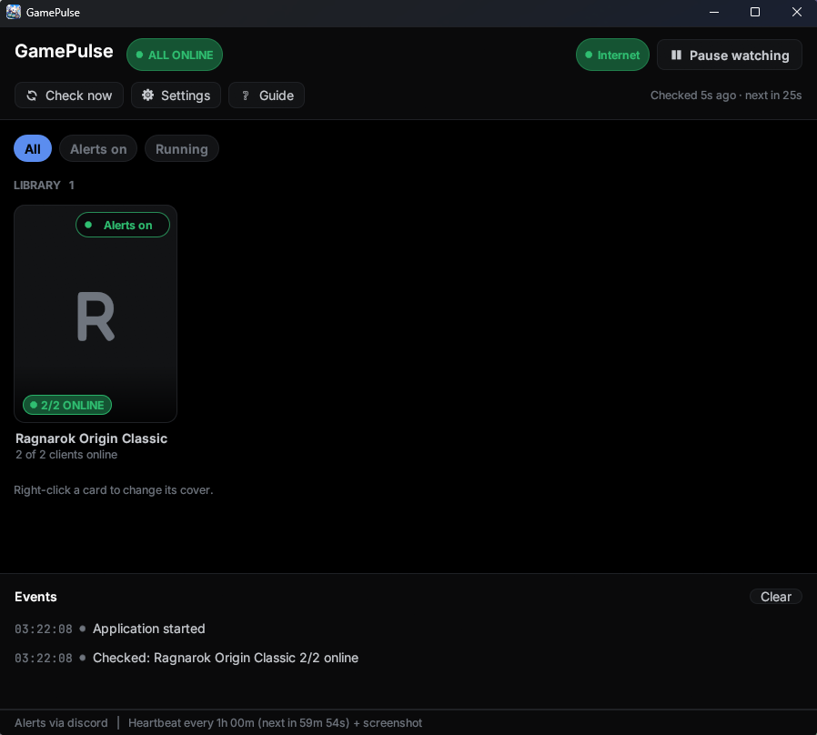
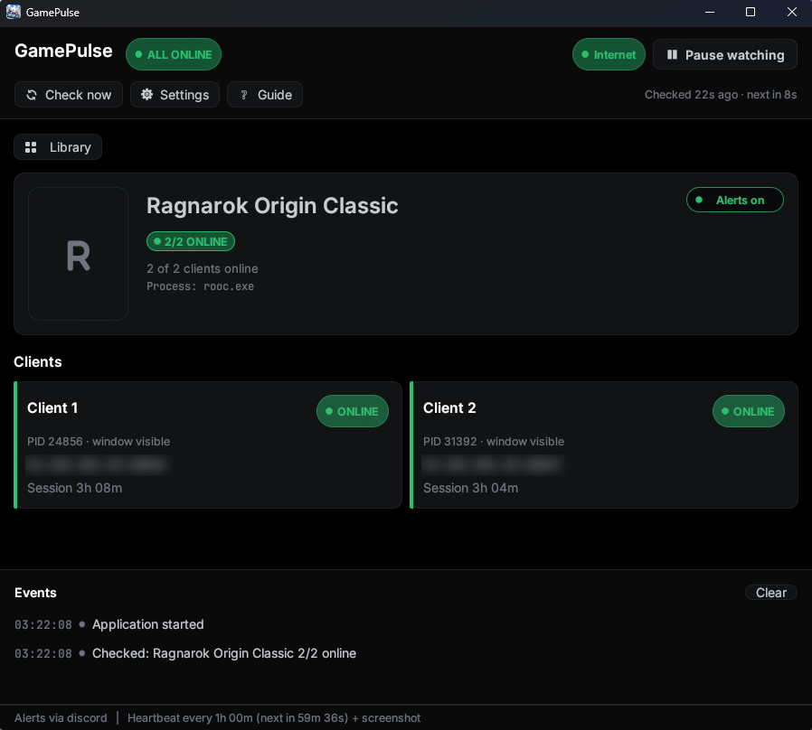

<p align="center"></p>

<h1 align="center">GamePulse</h1>

<p align="center"><a href="README.md">English</a> · <b>ภาษาไทย</b></p>

เฝ้าดูว่า client ของเกมยังต่อกับ game server อยู่ไหม แล้วเตือนเข้ามือถือเมื่อหลุด
เกมที่รองรับตอนนี้: **Ragnarok Origin Classic** (`rooc.exe`) หน้าหลักเป็น library ของเกม เฝ้าหลายเกมพร้อมกันได้

เป็นแอป Windows (Rust) ตัวเดียว อยู่ใน system tray เปิดทิ้งข้ามคืนได้ ไม่ต้องใช้ PowerShell
เสียงที่เครื่องคอมปิดไว้เป็นค่าเริ่มต้น เพราะนอนคนละห้องยังไงก็ไม่ได้ยิน
แอปจะไม่ยอมเริ่มเฝ้าถ้ายังไม่ได้ตั้งช่องทางเตือนเข้ามือถือ (จะได้ไม่เผลอเปิดทิ้งไว้ทั้งคืนแบบเตือนใครไม่ได้)

<p align="center">
  
  
</p>

## เริ่มใช้งาน

1. ไปที่หน้า [Releases](https://github.com/pawaretdev/game-pulse/releases/latest) โหลด `gamepulse-vX.Y.Z-windows-x64.zip`
   แล้วแตกไฟล์ไว้ในโฟลเดอร์ที่จะเก็บถาวร (เช่น `C:\Tools\GamePulse`) ไม่ต้องติดตั้ง
2. ดับเบิลคลิก **`gamepulse.exe`** — ไม่มีหน้าต่าง console โผล่
   ครั้งแรก Windows อาจขึ้น "Windows protected your PC" เพราะไฟล์ไม่ได้ sign ให้กด **More info** > **Run anyway**
3. เปิดครั้งแรกจะมี **หน้าตั้งค่า 4 ขั้น** พาทำ: เลือกช่องทางเตือน (ntfy / Discord / Telegram) → ส่ง test เข้ามือถือ →
   ดูวิธีตั้งมือถือให้ปลุกติด (Android/iPhone) → เลือกว่าจะเปิดพร้อม Windows และเริ่มเฝ้าอัตโนมัติไหม
4. ก่อนนอนกด **Settings > Test your setup > Run drill** อย่างน้อยหนึ่งครั้ง เพื่อพิสูจน์ว่ามัน "ปลุกติด" ไม่ใช่แค่ "ส่งถึง"
5. ปล่อยไว้ กด X ได้ มันจะย่อลง system tray แล้วเฝ้าต่อ

ปุ่ม **Guide** ที่หน้าหลักอธิบายความหมายของสถานะแต่ละสี, เตือนตอนไหน, แต่ละค่าใน Settings,
วิธีตั้งมือถือ และการแก้ปัญหา มีปุ่ม **Run setup again** ถ้าอยากเข้าหน้าตั้งค่าครั้งแรกใหม่

ถ้าใช้ ntfy: ลงแอป **ntfy** จาก Play Store / App Store กด **+** แล้ว subscribe topic ชื่อเดียวกับที่ใส่ในแอป
(หน้าตั้งค่ามีปุ่ม **Generate** สุ่มชื่อที่เดายากให้ และปุ่ม **Copy**) ชื่อ topic ห้ามบอกใคร เพราะ ntfy.sh เป็น server สาธารณะ ใครรู้ชื่อ topic ก็อ่านข้อความได้
(ข้อความมีแค่ PID กับเวลา ไม่มีข้อมูล account) ถ้าอยากปิดสนิทจริงๆ ต้อง self-host ntfy เอง แล้วใส่ใน `ntfy server`

## หน้าจอมีอะไรบ้าง

- หน้า **library** มีการ์ดต่อหนึ่งเกม บนปกบอกสถานะสด (`2/2 ONLINE`, `1 DISCONNECTED`, `NOT RUNNING`) เกมที่เปิดเตือนไว้แล้วหลุดจะขึ้นขอบแดง
- สวิตช์ **Alerts on / off** บนการ์ดเลือกว่าเกมไหนจะเตือน เปิดหลายการ์ด = เฝ้าหลายเกมพร้อมกัน ปุ่มกรองด้านบนเลือกดูทั้งหมด / เฉพาะที่เปิดเตือน / เฉพาะที่เปิดเกมอยู่
- คลิกการ์ดเพื่อเข้าหน้าของเกมนั้น ด้านบนมีปก สถานะ และสวิตช์เตือน ตามด้วยการ์ดต่อหนึ่ง client กด **Library** เพื่อกลับ
- แถบบนบอกสถานะรวม (ALL ONLINE / 1 DISCONNECTED / GAME NOT RUNNING / PAUSED), สถานะเน็ต และปุ่ม Start/Pause
- ข้างล่างบอกว่าเช็คล่าสุดเมื่อไหร่ และรอบถัดไปอีกกี่วินาที
- การ์ดต่อหนึ่ง client บอก ONLINE/หลุด, PID, ปลายทางที่ต่ออยู่, ต่อเนื่องมานานแค่ไหน หรือหลุดมานานเท่าไหร่
  ช่วงที่ socket หายแต่ยังไม่ครบ grace จะขึ้น `CONFIRMING 1/3` สีเหลือง
- ช่อง Events ไล่ประวัติว่าหลุด/ส่งเตือนตอนไหนบ้าง (ผลเช็คแต่ละรอบขึ้นเฉพาะตอนเปลี่ยน ส่วนไฟล์ log บันทึกทุกรอบ)
- แถบล่างบอกช่องทางเตือนที่ตั้งไว้ และ heartbeat รอบถัดไป
- ปิดหน้าต่าง = ย่อลง tray ไม่ใช่ปิดโปรแกรม คลิกซ้ายที่ไอคอน tray เพื่อเปิดกลับ ออกจริงคลิกขวา > **Exit**
- เปิด exe ซ้ำตอนที่ตัวเดิมเปิดอยู่ จะเรียกหน้าต่างเดิมขึ้นมา (เปิดได้ทีละตัว)

### Settings

| หมวด | มีอะไร |
|---|---|
| Appearance | เลือก theme: Midnight (ค่าเริ่มต้น), Night Watch, Poring, Frost, Mocha, Daylight — เห็นผลทันที กด Cancel แล้วกลับเป็นค่าเดิม |
| Notifications | ntfy topic/server, Discord webhook, Telegram bot, `@here`, เสียงที่เครื่องนี้ |
| Test your setup | **Test alert**, **Run drill**, **Test heartbeat**, **Capture desktop** — ใช้ค่าที่อยู่บนหน้าจอ แม้ยังไม่กด Save |
| Detection | ช่วงเวลาตรวจ, grace checks |
| Wake-up alerts | เตือนซ้ำทุกกี่นาที, ซ้ำสูงสุดกี่ครั้ง, หนึ่งรอบยิงกี่ใบ, ห่างกันกี่วินาที |
| Heartbeat | ส่งทุกกี่ชั่วโมง, แนบภาพหน้าจอไป Discord |
| App | เปิดพร้อม Windows, เริ่มเฝ้าทันทีเมื่อเปิดแอป |

- **Test alert** ยิงหนึ่งชุดเข้าทุกช่องทาง พิสูจน์แค่ว่า "ส่งถึง"
- **Run drill** ยิงชุดเดียวกับตอนหลุดจริง 5 รอบ ห่างกันตาม `Repeat every` ข้อความมีคำว่า `DRILL` กำกับ
  พิสูจน์ว่า "ปลุกติด" ซึ่งเป็นคนละเรื่องกัน drill เดินต่อแม้ปิด Settings และหยุดได้จากปุ่ม **Stop drill** ที่หน้าหลัก
- **Test heartbeat** ส่ง heartbeat ทันที ถ้าเปิดแนบภาพไว้จะได้เห็นว่าภาพไปถึง Discord จริง
- **Capture desktop** เซฟภาพ BMP ลงโฟลเดอร์ `screenshots/` เฉยๆ ไม่ส่งไปไหน

**ปกเกม** ไม่ได้แถมมากับแอป (ภาพเป็นลิขสิทธิ์ของผู้จัดจำหน่าย) ทุกเกมใช้ปก placeholder โล่งๆ ถ้าอยากใส่เอง: คลิกขวาที่การ์ดเกม (หรือกดไอคอนรูปภาพที่โผล่บนปกตอนชี้) > **Choose cover image**
แล้วเลือกไฟล์ PNG, JPG หรือ WebP (แนวตั้ง 3:4 สวยสุด) แอปจะเก็บสำเนาไว้ในโฟลเดอร์ `covers` ข้าง exe กด **Remove cover** เพื่อกลับไปใช้ placeholder

ค่าทั้งหมดเก็บใน `config.json` ข้างไฟล์ exe ส่วน log อยู่ที่ `gamepulse.log` ในโฟลเดอร์เดียวกัน
`config.json` มี webhook/token ห้ามส่งให้ใครหรือแนบตอนขอความช่วยเหลือ
(ถ้า build เองจาก repo นี้ แอปจะใช้ `config.json` ที่ root ของ repo แทน ไฟล์นี้ถูก gitignore ไว้แล้ว)

## สัญญาณที่ใช้

`rooc.exe` เปิด TCP ค้างไว้กับ gate server ตลอดเวลาที่อยู่ในเกม:

```
43.153.252.23:10011   <- client ที่ 1
43.153.252.23:10012   <- client ที่ 2
```

พอหลุด socket นั้นหายทันที ส่วน connection อื่น (443 ไป CDN, localhost ระหว่าง thread ในเกม)
ยังอยู่เหมือนเดิม ตัว process ก็ยังไม่ตายและ window title ก็ไม่เปลี่ยน
เพราะงั้น **การมี/ไม่มี socket ตัวนี้ คือตัวชี้สถานะออนไลน์ที่เชื่อถือได้ที่สุด**
โดยไม่ต้องแตะ memory เกมหรือยุ่งกับ anti-cheat เลย

แอปนับ socket ที่ Established, ไม่ใช่ localhost และไม่ใช่พอร์ต 80/443/8080 — ไม่ผูกกับ IP หรือพอร์ตตายตัว
ถ้าเกมย้ายเซิร์ฟก็ยังใช้ได้ แต่ละ client แยกด้วย PID + เวลาที่ process เริ่ม จะได้ไม่ปนกันเมื่อ Windows เอา PID เก่ามาใช้ใหม่

## เตือนเมื่อไหร่

| เหตุการณ์ | ความหมาย | ปลุกไหม |
|---|---|---|
| ไม่เจอ socket เกมติดกัน N รอบ | หลุดแล้ว ยังไม่กลับมา | ปลุก + เตือนซ้ำทุก 3 นาที |
| ไม่มี process `rooc.exe` | เกมปิด/crash ไปเลย | ปลุก + เตือนซ้ำ |
| client ตัวใดตัวหนึ่งหายไป | ปิด client นั้นไป | ปลุก |
| ต่อเน็ตออกนอกไม่ได้ | เน็ตหลุด (socket ที่เห็นเป็นของค้าง เชื่อไม่ได้) | ปลุก + เตือนซ้ำ |
| socket เกมมี creation time ใหม่ | หลุดแล้วเด้งกลับเองได้ | ไม่ปลุก แค่ให้เห็นตอนตื่น |
| กลับมาออนไลน์ / เน็ตกลับมา | หายห่วง | ไม่ปลุก |

หน่วงด้วย **Grace checks** เพื่อไม่ให้เตือนผิดตอนสลับแมพหรือเปลี่ยนตัวละคร
ค่าเริ่มต้น 3 รอบ × 30 วินาที = ต้องหลุดจริง 90 วินาทีถึงจะปลุก

**เตือนซ้ำ** (`Repeat every`) คือหัวใจของการปลุกให้ติด ยิงซ้ำเรื่อยๆ จนกว่าจะกลับมาออนไลน์
หรือครบ `Maximum repeats` ครั้ง ดีกว่าไปหวังพึ่ง vibration pattern ของแอปใดแอปหนึ่ง

**Heartbeat** (ค่าเริ่มต้นทุก 4 ชม.) ส่ง "Still watching" เพื่อให้แยกออกว่า
ที่เงียบทั้งคืนเป็นเพราะทุกอย่างปกติ หรือเพราะ monitor ตายไปตั้งแต่ตีสอง
ถ้าเปิด **Attach a desktop screenshot** จะแนบภาพหน้าจอทุกจอเป็น WebP ไปกับ heartbeat ใน Discord
ภาพนี้มีทุกอย่างที่เปิดอยู่บนจอ ปิดไว้เป็นค่าเริ่มต้น

การเฝ้าทำงานใน background thread แยกจากหน้าจอ ซ่อนลง tray แล้วยังเช็คและเตือนตามปกติ

## ตั้งให้เปิดเองตอนเข้า Windows

Settings > App > ติ๊ก **Open GamePulse when I sign in to Windows** แล้ว Save
(เขียนลง `HKCU\Software\Microsoft\Windows\CurrentVersion\Run` ไม่ต้องใช้สิทธิ์ admin และไม่ต้องใช้ Task Scheduler)
ติ๊ก **Start watching when the app opens** ไว้ด้วย ไม่งั้นแอปเปิดขึ้นมาแต่ยังไม่เฝ้า
ถ้าย้ายโฟลเดอร์ exe หรืออัปเดตเป็นเวอร์ชันใหม่ในโฟลเดอร์อื่น ให้ติ๊กออกแล้วติ๊กใหม่ เพื่อบันทึก path ใหม่
อัปเกรดจาก ROOC Monitor: ถ้าเคยเปิดให้เปิดพร้อม Windows ไว้ GamePulse จะย้ายค่านั้นมาชี้ที่ตัวเองตอนเปิดครั้งแรก

สำคัญกว่าตัวแอป: ไปตั้ง Power Options ให้ **Sleep = Never** ด้วย
ไม่งั้นเครื่องหลับแล้วทั้งเกมทั้ง monitor ก็ตายตามกัน ซึ่งอาจเป็นต้นเหตุที่หลุดตอนนอนตั้งแต่แรก

## อัปเดตเวอร์ชัน

1. คลิกขวาไอคอนใน tray > **Exit** (กด X แค่ซ่อนหน้าต่าง ไฟล์จะยังถูกล็อก)
2. แตก zip เวอร์ชันใหม่ทับไฟล์ `.exe` เดิมในโฟลเดอร์เดียวกัน `config.json` ไม่ถูกแตะ ค่าที่ตั้งไว้ยังอยู่

## ถอนการติดตั้ง

ไม่มีตัว uninstall แอปเขียนไฟล์แค่ในโฟลเดอร์ตัวเอง กับค่าเปิดพร้อม Windows หนึ่งค่าใน registry

1. ถ้าติ๊ก **Open GamePulse when I sign in to Windows** ไว้ ให้ติ๊กออกแล้ว Save ก่อน ไม่งั้น Windows จะพยายามเปิดไฟล์ที่ไม่มีแล้วทุกครั้งที่เข้าเครื่อง
2. คลิกขวาไอคอนใน tray > **Exit**
3. ลบโฟลเดอร์ทิ้ง จะลบ exe, `config.json` (มี webhook และ token), `gamepulse.log` และโฟลเดอร์ `screenshots` ไปพร้อมกัน

## ทำไมมือถือสั่นแค่ทีเดียว

มือถือสั่นหนึ่งครั้งต่อ notification หนึ่งใบ ความยาวการสั่นเป็นของ notification channel ฝั่ง OS
สั่งจากฝั่งเราไม่ได้ ต่อให้ส่ง `Priority: urgent` ไปก็ตาม

ทางแก้คือ **ยิงหลายใบติดกัน** ตั้งได้ใน Settings > Wake-up alerts

| ค่า | ความหมาย |
|---|---|
| Notifications per alert (`BurstCount`) | 1 = สั่นทีเดียว, 4 = สั่นสี่ที ค่าเริ่มต้น 4 |
| Gap between them (`BurstGapSec`) | ค่าเริ่มต้น 4 — ต่ำกว่า 3 วิ Android อาจกลืนใบหลังๆ |

เท่ากับหนึ่งครั้งที่หลุดจะได้ `BurstCount` ใบ แล้วทั้งชุดวนซ้ำทุก `Repeat every` นาที
จนกว่าจะกลับมาออนไลน์หรือครบ `Maximum repeats`

**ถ้าตั้ง `BurstCount` เป็น 1 ฟีเจอร์นี้จะไม่ทำงานเลย** หน้า Settings จะขึ้นคำเตือนสีเหลือง

## urgent ทำงานกับช่องทางไหนบ้าง

| ช่องทาง | รองรับ priority ไหม |
|---|---|
| ntfy | ส่ง `Priority: urgent` (ระดับ 5) — **มีผลเฉพาะบน Android** |
| Discord webhook | ไม่มี priority แต่ใส่ `@here` ให้ตอนหลุดจริงแล้ว |
| Telegram bot | ได้แค่เปิด/ปิดเสียง ไม่มีระดับความด่วน |

Discord จะขึ้น `@here` เฉพาะตอนเตือนแบบ urgent เท่านั้น ข่าวดีกับ heartbeat ไม่ ping
ปิดได้ที่ Settings > Notifications (`"DiscordHere": false` ใน `config.json`)

### หน้าตาข้อความใน Discord

ส่งเป็น embed ไม่ใช่ข้อความเปล่า สีแถบข้างบอกชนิดเหตุการณ์ได้ทันทีโดยไม่ต้องอ่าน

| สี | เหตุการณ์ |
|---|---|
| 🔴 แดง | หลุด / เกมปิด / เน็ตหลุด |
| 🟢 เขียว | กลับมาออนไลน์ / เน็ตกลับมา |
| 🟡 เหลือง | เด้งกลับเองได้ / drill |
| 🔵 ฟ้า | heartbeat กับข้อความทดสอบ |

ในตัว embed มี field บอก PID, หลุดมานานเท่าไหร่ และเป็นการเตือนซ้ำครั้งที่เท่าไหร่
ส่วน footer บอกว่าเป็นใบที่เท่าไหร่ของชุด (เช่น `alert 2 of 4`) จะได้รู้ว่าชุดยังยิงไม่ครบ

## บน iOS ต้องทำยังไง

iOS **ไม่มี notification channel** เหมือน Android เพราะงั้นคำแนะนำแนวตั้ง importance ของ channel
ใช้ไม่ได้ทั้งหมด และ `Priority: urgent` ที่ ntfy ส่งไปแทบไม่มีผลบน iOS

iOS สั่นหนึ่งครั้งต่อ notification หนึ่งใบ จบ ยืดไม่ได้ ทำซ้ำในใบเดียวไม่ได้
เพราะงั้น **`BurstCount` คือกลไกเดียวที่ควบคุมได้** อยากสั่นรัวขึ้นก็เพิ่มจำนวนใบ

สิ่งที่ควรตั้งบนเครื่อง:

1. Settings > Notifications > **ntfy** — เปิด Allow Notifications, Sounds, และตั้ง Banner Style เป็น **Persistent**
2. Settings > Focus > **Sleep** (หรือ Focus ที่เปิดตอนนอน) > Apps > อนุญาต **ntfy** และ **Discord**
   ข้อนี้สำคัญที่สุด ถ้าไม่ทำ Focus จะกลืนทุกอย่างเงียบสนิท
3. ถ้าในหน้า Notifications ของ ntfy มีตัวเลือก **Time Sensitive Notifications** ให้เปิดด้วย
4. เช็คว่าไม่ได้เปิด Silent switch ค้างไว้ และปิด Low Power Mode ตอนกลางคืน

ถ้าทำครบแล้วยังไม่ตื่น เหลือทางเดียวที่การันตีได้จริงบน iOS คือให้มัน**โทรเข้า**
ntfy.sh มีฟีเจอร์โทรในแพ็กเกจเสียเงิน ต้องชั่งน้ำหนักเอาว่าคุ้มกับค่ารายเดือนไหม

## ตั้งฝั่งมือถือให้ปลุกติด (Android)

1. ntfy > กด topic > **Notification settings** > เปิด **Dedicated channel**
2. เข้า channel นั้น ตั้ง Importance = **Urgent**, เปิด Vibration, เลือกเสียงที่ดัง
3. Settings > Sound & vibration > Do Not Disturb > **Apps** > อนุญาต ntfy ให้ผ่าน DND
4. Settings > Apps > ntfy > Battery > **Unrestricted** (ไม่งั้น Android จะหน่วง notification ตอนดึก)

ข้อ 3 กับ 4 สำคัญมาก ถ้าไม่ทำ ยังไงก็ไม่ตื่น

## คำสั่ง command line

`gamepulse-cli.exe` (อยู่ใน zip เดียวกัน) แยกจากตัว GUI ใช้ตรวจสถานะครั้งเดียวหรือทดสอบการจับภาพ ไม่เฝ้าและไม่ส่งเตือน:

```powershell
.\gamepulse-cli.exe --once      # JSON snapshot; exit 0 ออนไลน์ครบ, 1 มีตัวหลุด, 2 ไม่มีเกมที่รองรับเปิดอยู่, 3 อ่านไม่ครบ
.\gamepulse-cli.exe --capture   # จับภาพ desktop แล้วรายงาน metadata ไม่เขียนไฟล์
.\gamepulse-cli.exe --help
```

การ build จาก source, test, exit code และวิธีออก release อยู่ใน [DEVELOPMENT.md](DEVELOPMENT.md) (ภาษาอังกฤษ)

## ข้อจำกัด

บอกได้แค่ว่า **socket ยังอยู่ไหม** ไม่ได้บอกว่าตัวละครยังขยับอยู่จริง
และแยกไม่ออกระหว่าง "โดนเตะออก" กับ "ค้างอยู่หน้า login" — ทั้งคู่ขึ้นว่าหลุดเหมือนกัน
ซึ่งสำหรับงานนี้ก็ถือว่าเป็นเรื่องเดียวกันอยู่แล้ว

การเทียบผล API กับ `Get-NetTCPConnection` บนเครื่องจริง และการตรวจภาพ capture ในหลายสภาพ (หลายจอ, lock screen, sleep)
ยังไม่ได้ทำครบ ดูรายการที่ค้างใน [DEVELOPMENT.md](DEVELOPMENT.md#open-gates)

## License

[MIT](LICENSE) © 2026 pawaretdev ใช้ แก้ และแจกต่อได้ฟรี แค่คงข้อความลิขสิทธิ์ไว้

ฟอนต์ที่ฝังในแอปใช้สัญญา [SIL Open Font License 1.1](https://openfontlicense.org): [Inter](https://github.com/rsms/inter) ([license](assets/fonts/Inter-OFL.txt)), [JetBrains Mono](https://github.com/JetBrains/JetBrainsMono) ([license](assets/fonts/JetBrainsMono-OFL.txt)) และ [Fredoka](https://github.com/hafontia/Fredoka-One) ([license](assets/fonts/Fredoka-OFL.txt)) ในไฟล์ zip ที่ดาวน์โหลดจะมี license เหล่านี้อยู่ในโฟลเดอร์ `fonts/`

Ragnarok Origin เป็นเครื่องหมายการค้าของเจ้าของ โปรเจกต์นี้ไม่ได้เกี่ยวข้องหรือได้รับการรับรองจากเจ้าของเกม
